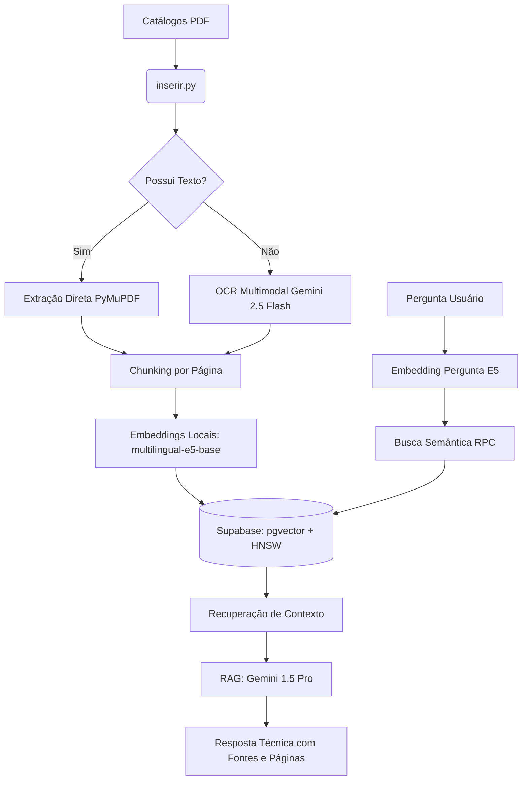

# OrcaHvac AI - Assistente Inteligente para Consulta de Catálogos Técnicos HVAC (Setor Orçamentos) 🚀

O **OrcaHvac AI** é um assistente técnico virtual especializado no setor de orçamentos de HVAC (Climatização, Ventilação e Aquecimento), desenvolvido para a equipe do **Grupo Retec**. Ele utiliza técnicas modernas de **RAG (Retrieval-Augmented Generation)**, banco de dados vetorial e inteligência artificial para extrair, indexar e buscar dados técnicos de forma ultra-precisa em catálogos das marcas **Armacell**, **Daikin** e **TROX** (incluindo PDFs nativos e imagens digitalizadas/escaneadas).

---

## 🛠️ Arquitetura e Tecnologias

O sistema combina eficiência local com a potência dos modelos multimodais de nuvem:



* **Processador de Documentos:** `PyMuPDF (fitz)` para leitura rápida e renderização de imagens de alta resolução (150 DPI) para OCR.
* **OCR Multimodal:** `Gemini 2.5 Flash` para ler PDFs digitalizados, convertendo tabelas complexas de HVAC fielmente em tabelas **Markdown**.
* **Modelo de Embeddings 100% Local:** `intfloat/multilingual-e5-base` rodando localmente na CPU via `sentence-transformers`, zerando os custos de tokenização e evitando erros de cota de embedding na nuvem.
* **Banco de Dados Vetorial:** `Supabase (PostgreSQL)` com a extensão `pgvector` e índice **HNSW (Hierarchical Navigable Small World)** para buscas rápidas.
* **RAG & IA Generativa:** `Gemini 1.5 Pro` (através de prompts rigorosos) gerando respostas técnicas baseadas exclusivamente no contexto, com citação explícita do arquivo e número de página correspondente.
* **Interface Frontend:** Painel web interativo em `Streamlit` contendo chat, visualizador de fontes consultadas e estatísticas em tempo real.

---

## 📁 Estrutura do Projeto

```text
catalogoIA/
│
├── .venv/                         # Ambiente virtual Python
├── .env                           # Configurações de API (Gemini e Supabase)
├── .env.example                   # Exemplo de configuração
├── requirements.txt               # Dependências do projeto
├── README.md                      # Documentação principal
│
├── banco/
│   └── esquema.sql                # Script SQL de criação de tabelas e funções RPC
│
├── inserir/
│   ├── leitor.py                  # Extração nativa de texto e OCR Multimodal com Gemini
│   └── inserir.py                 # Varredura, geração de embeddings e inserção no banco
│
└── app/
    ├── agente.py                  # Lógica de RAG, busca semântica e prompt do chatbot
    └── app.py                     # Interface do usuário em Streamlit
```

---

## 🚀 Como Executar o Projeto

### 1. Pré-requisitos
* Python 3.10 ou superior.
* Banco de dados cadastrado no Supabase (com suporte a `pgvector`).

### 2. Configuração do Banco de Dados (Supabase)
Abra o console do seu Supabase, navegue até **SQL Editor > New Query**, copie as instruções de [esquema.sql](file:///c:/Users/Tecnologia/Agente%20-%20Setor%20Or%C3%A7amentos/catalogoIA/banco/esquema.sql) e execute-as. Isso criará a tabela vetorial `documentos_catalogos_local` e a função de busca por cosseno `buscar_documentos_local`.

### 3. Configuração do Ambiente
Clone o projeto para a pasta desejada e crie o arquivo `.env` na raiz seguindo o modelo:

```env
# Chave da API do Google Gemini
GEMINI_API_KEY=sua_chave_aqui

# Conexão com o Supabase
SUPABASE_URL=https://seu-projeto.supabase.co
SUPABASE_KEY=sua-chave-publica-anon
SUPABASE_SERVICE_ROLE_KEY=sua-chave-service-role-admin
```

Instale as dependências necessárias no ambiente virtual:
```powershell
python -m venv .venv
.\.venv\Scripts\activate
pip install -r requirements.txt
```

### 4. Executando a Ingestão de Catálogos (Upload)
O pipeline suporta indexação incremental resiliente (você pode reiniciar de onde parou). Para indexar uma pasta de catálogos:

```powershell
.\.venv\Scripts\python inserir\inserir.py "C:\Caminho\Para\Seus\Catalogos"
```

### 5. Executando o Chatbot Streamlit
Para inicializar a interface web:

```powershell
.\.venv\Scripts\streamlit run app\app.py
```
Acesse `http://localhost:8501` em seu navegador para começar a perguntar!

---

## 🛡️ Robustez e Resiliência contra Limites de API (Rate Limits)
O sistema foi desenhado para lidar com as restrições e cotas do plano gratuito do Google AI Studio em cargas de trabalho massivas:
* **Filtro Nativo:** Evita fazer OCR em páginas que já possuem texto digitalizável.
* **Intervalo Controlado:** Sleep dinâmico de `12 segundos` entre chamadas de OCR, respeitando o limite de RPM (requisições por minuto).
* **Retentativas Inteligentes:** Implementação de loop de retentativa com **backoff exponencial** de até 5 tentativas no caso de limites temporários na API.
* **Prevenção de Duplicidade:** O pipeline checa o banco a cada arquivo e página. Em caso de parada forçada do script ou queda de energia, a indexação recomeça do ponto exato da parada sem corromper os dados.
